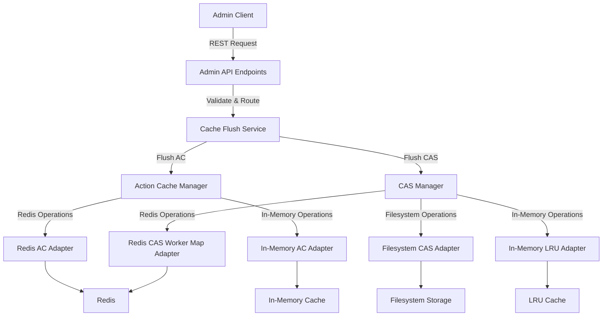

# Design Document: Cache Flush API

## Overview

The Cache Flush API is designed to provide BuildFarm administrators with the ability to selectively or completely flush parts of the Action Cache (AC) and Content Addressable Storage (CAS). This document outlines the architectural design, components, interfaces, data models, error handling, and testing strategy for implementing this feature.

## Architecture

The Cache Flush API will be implemented as an extension to the existing BuildFarm server architecture. It will consist of the following key components:

1. **Admin REST API Endpoints**: New endpoints will be added to the existing admin API to handle cache flushing requests.
2. **Cache Flush Service**: A service layer that processes flush requests and coordinates the flushing operations across different storage backends.
3. **Storage Backend Adapters**: Components that handle the actual flushing operations for specific storage backends (Redis, filesystem, in-memory).
4. **Authentication and Authorization**: Integration with the existing authentication system to ensure only authorized administrators can perform flush operations.
5. **Monitoring and Logging**: Components to track and report on flush operations.

### High-Level Architecture Diagram



## Components and Interfaces

### 1. Admin API Endpoints

New REST endpoints will be added to the existing admin API:

```
POST /admin/v1/cache/action/flush
POST /admin/v1/cache/cas/flush
```

#### Interface Definition

```java
/**
 * Flush Action Cache entries based on specified criteria.
 */
@POST
@Path("/admin/v1/cache/action/flush")
@Produces(MediaType.APPLICATION_JSON)
@Consumes(MediaType.APPLICATION_JSON)
public Response flushActionCache(ActionCacheFlushRequest request);

/**
 * Flush Content Addressable Storage entries based on specified criteria.
 */
@POST
@Path("/admin/v1/cache/cas/flush")
@Produces(MediaType.APPLICATION_JSON)
@Consumes(MediaType.APPLICATION_JSON)
public Response flushCAS(CASFlushRequest request);
```

### 2. Cache Flush Service

The Cache Flush Service will coordinate the flushing operations across different storage backends:

```java
public interface CacheFlushService {
  /**
   * Flush Action Cache entries based on specified criteria.
   */
  ActionCacheFlushResponse flushActionCache(ActionCacheFlushRequest request);
  
  /**
   * Flush Content Addressable Storage entries based on specified criteria.
   */
  CASFlushResponse flushCAS(CASFlushRequest request);
}
```

### 3. Storage Backend Adapters

#### Action Cache Adapters

```java
public interface ActionCacheAdapter {
  /**
   * Flush Action Cache entries based on specified criteria.
   */
  FlushResult flushEntries(FlushCriteria criteria);
}

public class RedisActionCacheAdapter implements ActionCacheAdapter {
  @Override
  public FlushResult flushEntries(FlushCriteria criteria) {
    // Implementation for flushing Redis-backed Action Cache entries
  }
}

public class InMemoryActionCacheAdapter implements ActionCacheAdapter {
  @Override
  public FlushResult flushEntries(FlushCriteria criteria) {
    // Implementation for flushing in-memory Action Cache entries
  }
}
```

#### CAS Adapters

```java
public interface CASAdapter {
  /**
   * Flush CAS entries based on specified criteria.
   */
  FlushResult flushEntries(FlushCriteria criteria);
}

public class FilesystemCASAdapter implements CASAdapter {
  @Override
  public FlushResult flushEntries(FlushCriteria criteria) {
    // Implementation for flushing filesystem-backed CAS entries
  }
}

public class InMemoryLRUCASAdapter implements CASAdapter {
  @Override
  public FlushResult flushEntries(FlushCriteria criteria) {
    // Implementation for flushing in-memory LRU cache entries
  }
}

public class RedisCASWorkerMapAdapter implements CASAdapter {
  @Override
  public FlushResult flushEntries(FlushCriteria criteria) {
    // Implementation for flushing Redis-backed CAS worker map entries
  }
}
```

### 4. Standalone Action Cache

The standalone Action Cache will be implemented as a separate component that can be independently configured and tested:

```java
public interface ActionCache {
  /**
   * Get an action result from the cache.
   */
  ActionResult get(ActionKey actionKey);
  
  /**
   * Put an action result into the cache.
   */
  void put(ActionKey actionKey, ActionResult actionResult);
  
  /**
   * Flush entries from the cache based on specified criteria.
   */
  FlushResult flush(FlushCriteria criteria);
}

public class StandaloneActionCache implements ActionCache {
  private final List<ActionCacheAdapter> adapters;
  
  public StandaloneActionCache(List<ActionCacheAdapter> adapters) {
    this.adapters = adapters;
  }
  
  @Override
  public ActionResult get(ActionKey actionKey) {
    // Implementation for getting an action result
  }
  
  @Override
  public void put(ActionKey actionKey, ActionResult actionResult) {
    // Implementation for putting an action result
  }
  
  @Override
  public FlushResult flush(FlushCriteria criteria) {
    // Implementation for flushing entries based on criteria
    FlushResult result = new FlushResult();
    for (ActionCacheAdapter adapter : adapters) {
      result.merge(adapter.flushEntries(criteria));
    }
    return result;
  }
}
```

## Data Models

### Request Models

```java
public class ActionCacheFlushRequest {
  private FlushScope scope; // ALL, INSTANCE, DIGEST_PREFIX
  private String instanceName; // Only used when scope is INSTANCE
  private String digestPrefix; // Only used when scope is DIGEST_PREFIX
  private boolean flushRedis;
  private boolean flushInMemory;
}

public class CASFlushRequest {
  private FlushScope scope; // ALL, INSTANCE, DIGEST_PREFIX
  private String instanceName; // Only used when scope is INSTANCE
  private String digestPrefix; // Only used when scope is DIGEST_PREFIX
  private boolean flushFilesystem;
  private boolean flushInMemoryLRU;
  private boolean flushRedisWorkerMap;
}

public enum FlushScope {
  ALL,
  INSTANCE,
  DIGEST_PREFIX
}
```

### Response Models

```java
public class ActionCacheFlushResponse {
  private boolean success;
  private String message;
  private int entriesRemoved;
  private Map<String, Integer> entriesRemovedByBackend;
}

public class CASFlushResponse {
  private boolean success;
  private String message;
  private int entriesRemoved;
  private long bytesReclaimed;
  private Map<String, Integer> entriesRemovedByBackend;
  private Map<String, Long> bytesReclaimedByBackend;
}
```

### Internal Models

```java
public class FlushCriteria {
  private FlushScope scope;
  private String instanceName;
  private String digestPrefix;
}

public class FlushResult {
  private boolean success;
  private String message;
  private int entriesRemoved;
  private long bytesReclaimed;
  
  public void merge(FlushResult other) {
    this.success = this.success && other.success;
    this.message = this.message + (this.message.isEmpty() ? "" : ", ") + other.message;
    this.entriesRemoved += other.entriesRemoved;
    this.bytesReclaimed += other.bytesReclaimed;
  }
}
```

## Error Handling

The Cache Flush API will handle errors using the following approach:

1. **Input Validation**: All API requests will be validated before processing. Invalid requests will return appropriate error responses with clear error messages.

2. **Partial Failures**: If a flush operation fails for some backends but succeeds for others, the API will return a partial success response with details about which operations succeeded and which failed.

3. **Concurrency Issues**: The implementation will handle concurrent flush requests and ensure thread safety.

4. **Backend Failures**: If a backend (Redis, filesystem, etc.) is unavailable or fails during a flush operation, the API will handle the failure gracefully and return an appropriate error response.

5. **Logging**: All errors will be logged with sufficient detail to aid in troubleshooting.

### Error Response Model

```java
public class ErrorResponse {
  private String errorCode;
  private String message;
  private Map<String, String> details;
}
```

## Testing Strategy

The testing strategy for the Cache Flush API will include:

### Unit Tests

1. **API Endpoint Tests**: Verify that the API endpoints correctly validate input and route requests to the appropriate services.
2. **Service Layer Tests**: Test the Cache Flush Service to ensure it correctly coordinates flush operations across different backends.
3. **Adapter Tests**: Test each storage backend adapter to ensure it correctly flushes entries based on the specified criteria.
4. **Standalone Action Cache Tests**: Comprehensive tests for the standalone Action Cache implementation.

### Integration Tests

1. **End-to-End Tests**: Verify that the entire flush operation works correctly from API request to storage backend.
2. **Concurrency Tests**: Test the API under concurrent load to ensure thread safety.
3. **Error Handling Tests**: Verify that the API correctly handles various error conditions.

### Performance Tests

1. **Load Tests**: Test the API under high load to ensure it performs adequately.
2. **Resource Usage Tests**: Monitor resource usage during flush operations to ensure they don't impact system performance.

### Test Scenarios

1. **Flush All Action Cache Entries**: Verify that all Action Cache entries are removed when requested.
2. **Flush Instance-Specific Action Cache Entries**: Verify that only entries for the specified instance are removed.
3. **Flush Digest-Prefix-Specific Action Cache Entries**: Verify that only entries with the specified digest prefix are removed.
4. **Flush All CAS Entries**: Verify that all CAS entries are removed when requested.
5. **Flush Instance-Specific CAS Entries**: Verify that only entries for the specified instance are removed.
6. **Flush Digest-Prefix-Specific CAS Entries**: Verify that only entries with the specified digest prefix are removed.
7. **Concurrent Flush Operations**: Verify that concurrent flush operations are handled correctly.
8. **Invalid Request Handling**: Verify that invalid requests are rejected with appropriate error messages.
9. **Authorization Tests**: Verify that only authorized users can perform flush operations.

## Implementation Considerations

1. **Performance Impact**: Flush operations, especially for large caches, can be resource-intensive. The implementation should consider strategies to minimize the impact on ongoing build operations, such as:
   - Batching deletions
   - Rate limiting
   - Background processing for large operations

2. **Monitoring**: The implementation should include monitoring capabilities to track:
   - Number of flush operations
   - Number of entries removed
   - Amount of space reclaimed
   - Duration of flush operations

3. **Configuration**: The implementation should allow for configuration of:
   - Rate limits for flush operations
   - Maximum concurrent flush operations
   - Timeout values for flush operations

4. **Documentation**: Comprehensive documentation should be provided for:
   - API endpoints and parameters
   - Error codes and messages
   - Example requests and responses
   - Best practices for using the API